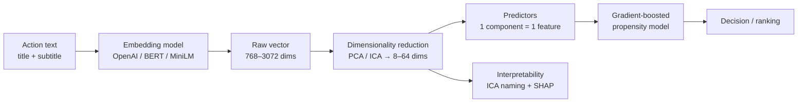

# Turning Marketing Copy into Model Predictors

### How LLM embeddings can help with offer cold-start in retail-banking next-best-action — and how to keep them interpretable

*Applied data science write-up · ~20 min read*

---

## TL;DR

Adaptive decisioning systems (Pega CDH, and propensity models in general) are very good at learning from structured inputs — customer demographics, behavioral counters, case parameters — and almost blind to the *text* attached to the thing they're deciding about: the offer headline, the product subtitle, the terms summary, the support-case comment. That text can carry real predictive signal (brand, offer mechanics, rate and promo language, tone), and it is often exactly the signal you're missing when a brand-new offer goes live with zero interaction history.

This post walks through a production-minded recipe for closing that gap:

1. **Encode the action's text as an LLM embedding**, then compress it into a handful of numeric predictors you can actually serve.
2. **Feed those predictors to a gradient-boosted model** (CatBoost / Pega AGB) — *not* a Naive Bayes model, and the reason why matters.
3. **Recover interpretability** — usually the first casualty of embedding features — using Independent Component Analysis plus a simple "name the component by its extreme examples" trick, wired together with SHAP.

The headline business value is **cold-start**: new actions can inherit sensible propensity from semantically similar past actions on day one. Along the way I'll be honest about what the common "probe" experiments do and don't prove, and I'll close with a validation checklist you should clear before trusting any of this in production.

All code below is illustrative and deliberately small. It's distilled from a real implementation on retail-banking offer data, with secrets, local paths, and shortcuts removed. **All bank names, product names, and offer copy in this post are fictional and used purely for illustration.**

---

## 1. The problem: structured models, unstructured reality

A propensity model for "will this customer take up this offer?" typically trains on features like:

- `ClickedCount30Days`, `ViewedCount30Days`, `ProductScore` — behavioral counters
- `ProductCategory`, `ProductSubCategory`, `pyGroup` — taxonomy / category metadata
- `pyName`, `pyTreatment` — identifiers for the specific action and treatment

That last group is doing something subtle and fragile. `pyName` / `pyTreatment` are essentially high-cardinality categorical IDs. The model learns a per-ID effect — effectively memorizing "this exact offer historically clicked well." That works for mature offers with lots of history and becomes weak for new ones: a freshly launched offer is just a new category level the model has never seen, so it falls back to a prior or to coarse product/category metadata.

But look at what the offer copy actually *says* (all fictional, across the bank's markets):

> **"AuroraCard Platinum — 0% on balance transfers for 18 months"**  *(EN)*
> **"NordKredit Autokredit — Ihr neues Auto ab 2,9 % eff. Jahreszins"**  *(DE)*
> **"Prêt Auto Lumina — financez votre voiture à 2,9 % TAEG"**  *(FR)*
> **"EverSpaar Termijndeposito — 3,5 % rente, 12 maanden vast"**  *(NL)*

A human instantly reads brand, product type, rate/promo mechanic, and tone. Some of that may already be present as coarse taxonomy, but the copy captures much finer signal: promo mechanics, rate language, positioning, urgency, and cross-language phrasing. Crucially, a *new* "Aurora Autolening — vanaf 3,4 %" offer is semantically close to past Aurora auto-loan offers — and even to NordKredit's German-language car-loan copy — even though its ID is brand new. That cross-lingual semantic neighborhood is exactly what an embedding gives you.

So the reframing is:

> **This isn't "add an NLP feature." It's "reduce action cold-start by replacing memorized IDs with a semantic representation that generalizes across actions."**

That framing is the thesis of this post, and it changes how you evaluate the idea (more on that in §6 and §10).

---

## 2. The pipeline at a glance



Four moving parts: **embed → reduce → predict → explain.** We'll take them one at a time.

---

## 3. Step 1 — From text to vectors

An embedding maps a string to a fixed-length vector of floats such that semantically similar strings land near each other. You do not need to train or host a neural network to get one; you call a model.

### Option A: a hosted API (fastest to prototype)

```python
from openai import OpenAI
import os

client = OpenAI(api_key=os.environ["OPENAI_API_KEY"])  # never hard-code keys

EMBED_MODEL = "text-embedding-3-large"
EMBED_DIMS = 256  # text-embedding-3-* lets you request a shorter native vector

def embed(text: str) -> list[float]:
    text = text.replace("\n", " ").strip()
    resp = client.embeddings.create(
        input=[text],
        model=EMBED_MODEL,
        dimensions=EMBED_DIMS,
    )
    return resp.data[0].embedding
```

Two practical notes:

- The `dimensions` parameter on `text-embedding-3-*` lets you ask the model for a shorter vector directly (Matryoshka-style truncation), which is cheaper to store and a reasonable *first* compression step. It is not a substitute for the task-aware reduction in §4.
- **Cost is usually small at this granularity, but still estimate it.** You embed *actions/treatments*, not every decision. There might be a few thousand of them, embedded once at create/update time and cached — not called on the hot decisioning path. For the data here, embedding the entire offer set costs on the order of cents; your mileage depends on model choice, text length, and refresh cadence.

### Option B: open-source, self-hosted (when data can't leave)

Many clients can't ship offer text or customer support logs to a third-party API. A sentence-transformer runs locally and is multilingual:

```python
from sentence_transformers import SentenceTransformer

model = SentenceTransformer("paraphrase-multilingual-MiniLM-L12-v2")
vectors = model.encode(
    ["AuroraCard Platinum - 0% balance transfers 18 mo", "Pret Auto Lumina - 2,9% TAEG"],
    convert_to_numpy=True,
    normalize_embeddings=True,
)
```

The choice between A and B is mostly governance, latency, cost, and domain fit — benchmark enough to know the quality is acceptable, then pick one and pin it. (Mixing embedding models across experiments is fine for exploration but a recipe for confusion when you write up results; see §11.)

### Build the text field deliberately

Garbage in, garbage out applies doubly here. Concatenate the fields that carry meaning and strip the rest:

```python
import pandas as pd

actions = actions.fillna("")
actions["TextData"] = (actions["Title"].astype(str) + " " +
                       actions["SubTitle"].astype(str)).str.strip()
actions = actions.drop_duplicates(subset=["TextData"])
```

Embed `TextData`, keep a stable join key, cache the result. Everything downstream joins back to this.

---

## 4. Step 2 — Make the vectors deployable

A raw embedding is 768 (BERT), 384 (MiniLM), or 3072 dimensions by default for `text-embedding-3-large`. You usually can't and shouldn't load 1536+ predictors into an adaptive model. You want a *handful* of stable, numeric predictors — say 8 to 64 — where **one component maps to one model predictor.**

There are two reasons to reduce, and they pull in slightly different directions:

- **Operational:** fewer predictors = simpler mapping, lower storage, faster scoring.
- **Statistical:** dense correlated dimensions are noisy; a compact basis can generalize better.

PCA and ICA are the workhorses. PCA gives you orthogonal axes ordered by variance. ICA gives you *statistically independent* components that, as we'll see in §8, tend to be far more *interpretable*.

### Fit the reducer

```python
import numpy as np
from sklearn.decomposition import PCA, FastICA

# matrix: (n_actions, embedding_dim) array of raw embeddings
N_COMPONENTS = 32

pca = PCA(n_components=N_COMPONENTS, random_state=42).fit(matrix)
ica = FastICA(n_components=N_COMPONENTS, whiten="unit-variance",
              random_state=42, max_iter=1000).fit(matrix)
```

How many components? Don't pick by explained variance alone — embeddings are usually not so low-rank that the variance curve settles the question. Pick by **downstream lift**: sweep `N_COMPONENTS ∈ {8, 16, 32, 64}`, train the propensity model for each, and keep the smallest that doesn't cost you AUC (§6 and §10).

### Bake the transform into a servable artifact

A neat trick: a fitted PCA/ICA is just an affine map (`x → W·(x − mean)`), so you can freeze it as a single linear layer and ship it next to the embedding model. No scikit-learn dependency at serve time, and the exact same transform in training and production.

```python
import torch
from torch import nn

class FrozenLinearReducer(nn.Module):
    """Wraps a fitted PCA/ICA as a deployable linear projection."""
    def __init__(self, components: np.ndarray, mean: np.ndarray | None = None):
        super().__init__()
        out_dim, in_dim = components.shape
        if mean is None:
            self.mean = None
        else:
            self.register_buffer("mean", torch.tensor(mean, dtype=torch.float32))
        self.linear = nn.Linear(in_dim, out_dim, bias=False)
        self.linear.weight = nn.Parameter(torch.tensor(components, dtype=torch.float32))
        self.linear.weight.requires_grad_(False)

    @torch.no_grad()
    def forward(self, x: np.ndarray) -> np.ndarray:
        x = torch.tensor(x, dtype=torch.float32)
        if self.mean is not None:
            x = x - self.mean
        return self.linear(x).numpy()

pca_reducer = FrozenLinearReducer(pca.components_, pca.mean_)
ica_reducer = FrozenLinearReducer(ica.components_, ica.mean_)
reduced = ica_reducer(matrix)            # (n_actions, N_COMPONENTS)
```

Now `reduced[:, i]` is predictor `lower_dim_embedding_i`. Map each to a parameterized Pega predictor and you're done with feature engineering.

> **Aside — PCA vs ICA vs KernelPCA.** All three are worth trying, but for *different* jobs. Use **PCA** when you want a compact, decorrelated prediction baseline. Use **ICA** when you want components a human can name (§8), and make sure the propensity model actually trains on those ICA components if you plan to connect SHAP ranks to ICA names. KernelPCA can capture nonlinear structure but is harder to serve as a frozen linear layer and rarely earns its keep here. The correlation heatmap of PCA outputs should be near-diagonal — a quick sanity check that your reducer behaves.

---

## 5. A necessary detour: do the embeddings actually encode anything useful?

Before wiring embeddings into a propensity model, it's worth proving they carry the signal you *think* they carry. The cheap way to do this is a **probe**: train a throwaway classifier to predict a known attribute (product category, language, brand) *from the embedding alone*.

```python
from catboost import CatBoostClassifier
from sklearn.model_selection import train_test_split

X = reduced                                  # embedding-derived features only
y = actions["ProductCategory"]               # known product category

X_tr, X_te, y_tr, y_te = train_test_split(X, y, test_size=0.25, random_state=42)
probe = CatBoostClassifier(iterations=200, depth=6, learning_rate=0.1,
                           loss_function="MultiClass", verbose=False)
probe.fit(X_tr, y_tr)
print("probe accuracy:", probe.score(X_te, y_te))
```

Run this for `ProductCategory`, `Language`, `pyGroup`, and even binary "does the text mention *Aurora* / *Lumina*" targets, and you should get strong scores. For binary probes, AUC is useful; for multiclass probes, accuracy or macro-F1 is usually easier to read. Literal targets such as brand mentions may be near-perfect, which is useful as a wiring check but not surprising.

### Read these results correctly

Here is the honest framing, and it matters:

> **These probes demonstrate *feasibility*, not *lift*.** A near-perfect score on "predict the brand from the embedding" is largely *tautological* — the title literally contains the word "Aurora," so of course a representation of that title can recover it. What the probe proves is that **the embedding faithfully preserves human-meaningful structure** (brand, category, language) in a compact numeric form. That's a genuine and useful result: it's the empirical green light that the representation is sound and that downstream models *can* exploit this information.

> **What it does *not* prove is that embeddings improve click-through prediction.** That's a separate, harder claim that requires the propensity experiment in §6 with a proper held-out evaluation. Don't let a beautiful probe AUC stand in for CTR evidence in a results section — reviewers (and skeptical stakeholders) will catch it, and rightly so.

So: probes are the feasibility gate. They tell you the pipeline is wired correctly and the representation is rich. Treat them as exactly that.

A complementary, very persuasive sanity check is to project the embeddings to 2-D/3-D and color by a known taxonomy:

```python
from sklearn.manifold import TSNE
proj = TSNE(n_components=2, perplexity=30, init="pca", random_state=42).fit_transform(reduced)
# scatter proj, colored by ProductCategory -> clusters should mirror the taxonomy
```

If the t-SNE clusters line up with product categories, you've shown — visually, to a non-technical audience — that "text structure mirrors the product taxonomy." Great for a stakeholder deck.

---

## 6. Step 3 — Embeddings as predictors in the real model

Now the actual task: predict the interaction outcome (Clicked vs Impression) from **customer features + the embedding predictors**, replacing the brittle `pyName`/`pyTreatment` IDs.

```python
import numpy as np
from catboost import CatBoostClassifier, Pool

# df: one row per (decision, treatment) with customer features already typed,
# joined to the 32 embedding columns lower_dim_embedding_0..31
embedding_cols = [f"lower_dim_embedding_{i}" for i in range(N_COMPONENTS)]
feature_cols = customer_feature_cols + embedding_cols   # note: pyName/pyTreatment dropped

params = dict(
    loss_function="Logloss",
    eval_metric="AUC",
    iterations=300,
    depth=7,
    learning_rate=0.1,
    random_seed=31,
    cat_features=customer_cat_cols,
)
```

### Evaluate it the way the *claim* demands

This is where most write-ups (mine included, in earlier drafts) get sloppy. If your thesis is **cold-start**, a random row-level train/test split is misleading — the same action ID leaks into both sides, so the model can still memorize and you'll *overstate* generalization.

Evaluate the way you'll actually be used:

```python
from sklearn.model_selection import GroupShuffleSplit

# Hold out ENTIRE actions, so test actions are unseen at train time -> true cold-start
splitter = GroupShuffleSplit(n_splits=1, test_size=0.2, random_state=42)
train_idx, test_idx = next(splitter.split(df, df["Decision_Outcome"], groups=df["pyName"]))

X_train, y_train = df.iloc[train_idx][feature_cols], df.iloc[train_idx]["Decision_Outcome"]
X_test,  y_test  = df.iloc[test_idx][feature_cols],  df.iloc[test_idx]["Decision_Outcome"]

# fit on seen actions, evaluate on the held-out unseen ones
model = CatBoostClassifier(**params)
model.fit(Pool(X_train, y_train, cat_features=customer_cat_cols), verbose=50)
```

Then compare, on those held-out unseen actions:

| Model | Held-out-action AUC |
|---|---|
| Customer features only | baseline |
| Customer features + `pyName`/`pyTreatment` IDs | usually ≈ baseline for unseen IDs |
| Customer features + embedding predictors | **the number that matters** |

The embedding row is the one that earns the project. If embeddings beat the ID-based model *on actions neither has seen*, you've demonstrated the actual value — semantic generalization to new content — rather than a probe tautology. Report it with a confidence interval (bootstrap the test actions), not a single point estimate.

One extra trap: logged decisioning data is not a random sample of all customer-action pairs. It reflects the policy that decided which offers were shown, so the training set has exposure bias baked in. Keep the offline comparison within the same logged-policy window, be cautious about causal claims, and treat an online A/B test as the final proof of business value.

---

## 7. Why gradient boosting, and *not* Naive Bayes

This deserves its own section because it's the most common way to get the idea wrong.

Adaptive decisioning historically leans on **Naive Bayes**-style models: fast, online-updatable, one model instance per action. They assume **conditional independence** of predictors given the class. That assumption is already approximate for hand-picked structured features; it is a bad fit for dense embedding dimensions, which are correlated by construction — neighboring components often encode overlapping semantics. Feed 32 correlated embedding dims into Naive Bayes and it can overcount the same evidence, producing miscalibrated, overconfident scores.

**Gradient-boosted trees** (CatBoost here; Pega's Adaptive Gradient Boosting in CDH) have no independence assumption. They model interactions and correlated inputs natively, split on whichever components carry signal, and degrade gracefully when components are redundant. They also bring two structural bonuses for this use case:

- **Potentially one model instance per channel** instead of one per action-channel pair, because the action's identity now lives in its *features* (the embedding), not in *which model* you route to. That can collapse a whole layer of model management.
- **No separate "immature action" fallback model** — the cold-start case is handled by the same model, because a new action simply presents a new-but-meaningful feature vector.

So the rule of thumb:

> **Embedding predictors usually belong with gradient boosting. If your decisioning layer is Naive Bayes, consider changing the model class first — otherwise the embeddings may quietly make calibration worse.**

---

## 8. The elephant: embeddings aren't interpretable. Until you make them.

Everything so far has a well-known cost. A predictor called `lower_dim_embedding_9` is meaningless to a human. When the business asks "*why* did the model favor this offer?", "because dimension 9 was high" is not an answer. This is the single biggest objection to embedding features in regulated, explainability-conscious environments — and it's the part of this work I think is most worth publishing, because there's a clean fix.

The fix has four layers.

### Layer 1 — SHAP tells you *which* components matter

```python
import shap
explainer = shap.TreeExplainer(model)

# Explain on the FULL feature set the model was trained on, then focus on the
# embedding columns. Passing only a subset of columns would mismatch the model.
shap_values = explainer.shap_values(X_test[feature_cols])
emb_idx = [feature_cols.index(c) for c in embedding_cols]
shap.summary_plot(shap_values[:, emb_idx], X_test[embedding_cols], plot_type="bar")
```

This ranks the embedding components by contribution. Necessary, but only half the story — it tells you dimension 9 matters, not what dimension 9 *means*.

### Layer 2 — ICA makes components nameable

Here's the key insight: **PCA components are optimized for variance, not meaning, so they tend to be blends of concepts. ICA components are optimized for statistical independence, which often aligns them with sparser, more nameable directions** — closer to "one component ≈ one human-recognizable theme." That property is what makes the next trick work.

### Layer 3 — Name a component by its extreme examples

For each ICA component, list the actions that score highest on it. The shared theme gives you a first-pass label for what the component appears to capture.

```python
import numpy as np

def name_component(texts, ica_scores, component_idx, top_k=10):
    """Return the top_k texts that load most strongly on a component."""
    order = np.argsort(ica_scores[:, component_idx])[::-1][:top_k]
    return [(texts[i], float(ica_scores[i, component_idx])) for i in order]

ica_scores = ica_reducer(matrix)            # frozen ICA from §4
for c in [9, 14, 3]:                        # e.g., the top-SHAP components
    print(f"\n=== Component {c} ===")
    for text, score in name_component(actions["TextData"].tolist(), ica_scores, c):
        print(f"  {score:+.2f}  {text}")
```

Typical output reads like:

```
=== Component 9 ===
  +4.12  Pret Auto Lumina - financez votre voiture a 2,9% TAEG     (FR)
  +3.97  NordKredit Autokredit - Ihr neues Auto ab 2,9% Zins       (DE)
  +3.55  Aurora Auto Loan - drive away today at 3.4% APR           (EN)
  ...        # -> "auto-loan / car financing" component (note: cross-language!)
```

### Layer 4 — Wire SHAP and naming together

The payoff is to chain them: take the components SHAP says matter most, then name those components. Now you have a sentence the business understands.

```python
import pandas as pd

mean_abs = np.abs(shap_values).mean(axis=0)
ranking = pd.Series(mean_abs, index=embedding_cols).sort_values(ascending=False)

for col in ranking.head(5).index:
    c = int(col.split("_")[-1])
    examples = name_component(actions["TextData"].tolist(), ica_scores, c, top_k=5)
    theme = ", ".join(t for t, _ in examples[:3])
    print(f"{col} (SHAP rank high) ≈ theme: {theme}")
```

Output you can put in front of a stakeholder:

> *"The model's propensity here is driven mainly by component 9 — the **auto-loan** theme — and component 14 — the **0%-balance-transfer** theme ('0% on balance transfers', '0% auf Umbuchungen'). For this customer, the auto-loan theme pushes propensity up."*

That can be defensible interpretability for an embedding-based model, provided the component names are stable enough to survive the checks below. It's the contribution I'd build the article's reputation on.

### One caveat to state plainly

ICA component **sign and order are not deterministic** across runs and depend on the random seed and data sample. Before you claim "component 9 *is* auto loans," verify stability: refit ICA on bootstrap resamples and confirm the named themes reappear (match components across runs by correlation, align signs). If a theme is stable across resamples, the naming is trustworthy; if it isn't, treat it as exploratory color, not a fact. Honesty here is what separates a credible methods post from a demo.

---

## 9. Bonus: the most intuitive explanation of all

For cold-start specifically, there's an explanation even simpler than SHAP-plus-ICA, and business users love it: **nearest neighbors in embedding space.**

```python
from sklearn.metrics.pairwise import cosine_similarity

def similar_actions(query_idx, texts, vectors, k=5):
    sims = cosine_similarity(vectors[query_idx:query_idx+1], vectors)[0]
    order = np.argsort(sims)[::-1][1:k+1]
    return [(texts[i], float(sims[i])) for i in order]
```

> *"This brand-new offer has no history, but its text places it near these five past offers — which converted well with this segment."*

That single sentence often does more to build trust in the whole approach than any SHAP plot, because it makes the cold-start mechanism tangible.

---

## 10. What to validate before you trust this in production

The exploratory work proves feasibility. Production needs more. Treat this as a checklist, not an afterthought:

1. **Cold-start ablation, done right.** Held-out *actions* (not rows), embeddings vs ID-based baseline vs customer-only, AUC with bootstrap confidence intervals. This is the experiment that justifies the project.
2. **Component count sweep.** Choose dimensionality by downstream AUC, not explained variance. Show the 8/16/32/64 curve.
3. **One embedding model, pinned.** Decide API vs open-source on governance + latency, fix the model and version, and record it. Don't compare results produced by different embedders.
4. **Logged-policy bias.** Offline data reflects the offers your old policy chose to expose. Don't make causal lift claims from AUC alone; use offline results as screening evidence and online tests for business proof.
5. **Online lift.** Offline AUC is necessary, not sufficient. The strongest evidence is an A/B test measuring CTR on *new* actions in the first days of life — exactly where cold-start bites. If you have this, it's the centerpiece of the whole story.
6. **ICA stability.** Bootstrap-verify that named components reproduce before publishing any "component = concept" claim.
7. **Calibration, not just ranking.** AUC measures ordering; decisioning often needs calibrated probabilities. Check a reliability curve.
8. **No leakage in the text field.** Make sure `TextData` doesn't accidentally include post-hoc fields (final price after the campaign, outcome-derived tags).

---

## 11. Operational realities

A few things that don't show up in a notebook but will in production:

- **Embedding drift.** Your predictors are defined by an external model. If the vendor deprecates or silently updates it, your feature distribution shifts under you. Pin the model version, and treat a model upgrade as a feature change that requires re-embedding the offer set and re-validating.
- **Refresh cadence.** New brands, slang, and campaign language appear. Re-embed new actions continuously (cheap), and retrain the reducer + propensity model on a schedule.
- **Latency.** Embed and reduce at action **create/update** time and cache the predictors on the action record. Nothing on the live decisioning path should call an embedding API.

---

## 12. Takeaways

If you remember three things:

1. **Reframe the win as cold-start, not "an NLP feature."** Embeddings can let a brand-new action inherit propensity from its semantic neighbors, replacing brittle memorized IDs. Evaluate on *held-out actions* or you're measuring the wrong thing.
2. **Pair embeddings with gradient boosting by default, not Naive Bayes.** Dense correlated dimensions strain the independence assumption; trees handle them natively and can collapse a layer of model management in the process.
3. **You can recover useful interpretability.** ICA components named by their extreme examples, ranked by SHAP, and backed by nearest-neighbor explanations can turn "dimension 9" into "the auto-loan theme." That recovery is the part worth publishing.

And one discipline point that underlies all of it: **be precise about what each experiment proves.** Probes show the representation is rich (feasibility). The cold-start ablation shows it's useful (lift). The online test shows whether it's worth money. Keep those three claims in their own lanes and the work is much harder to poke holes in.

---

### Appendix: minimal end-to-end skeleton

```python
# 1. EMBED (once, cached) ------------------------------------------------------
actions = actions.fillna("")
actions["TextData"] = (actions["Title"].astype(str) + " " +
                       actions["SubTitle"].astype(str)).str.strip()
matrix = np.vstack(actions["TextData"].map(embed))          # §3

# 2. REDUCE (fit once, freeze, serve) -----------------------------------------
ica = FastICA(n_components=32, whiten="unit-variance",
              random_state=42, max_iter=1000).fit(matrix)
ica_reducer = FrozenLinearReducer(ica.components_, ica.mean_)  # §4
reduced = ica_reducer(matrix)
for i in range(32):
    actions[f"lower_dim_embedding_{i}"] = reduced[:, i]

# 3. PREDICT (cold-start split, drop IDs) -------------------------------------
groups = train_df["pyName"]                                 # §6
train_idx, test_idx = next(GroupShuffleSplit(n_splits=1, test_size=0.2, random_state=42)
                           .split(train_df, y, groups=groups))
model = CatBoostClassifier(**params).fit(train_df.iloc[train_idx][feature_cols],
                                         y.iloc[train_idx])

# 4. EXPLAIN (SHAP rank -> ICA naming -> NN) ----------------------------------
shap_values = shap.TreeExplainer(model).shap_values(test_df[embedding_cols])  # §8
# rank components, name top ones via name_component(), and offer NN examples   # §8–9
```

*Replace `embed`, the feature lists, and the data frames with your own; everything else is the recipe.*
